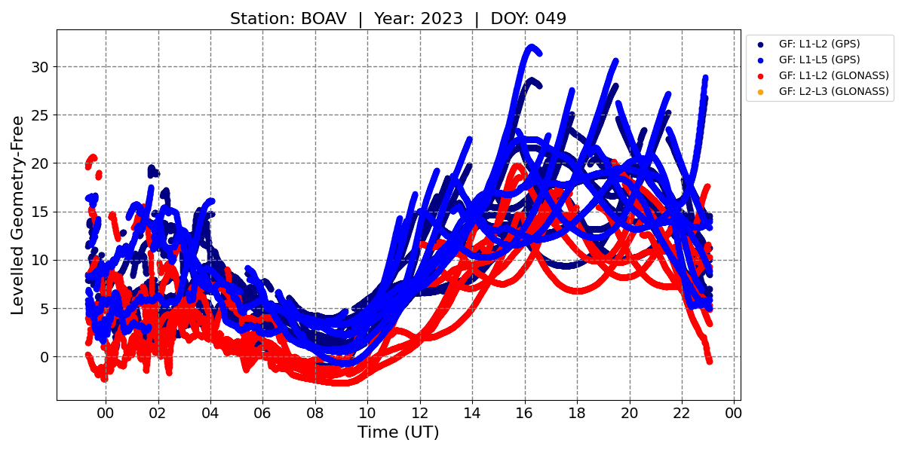
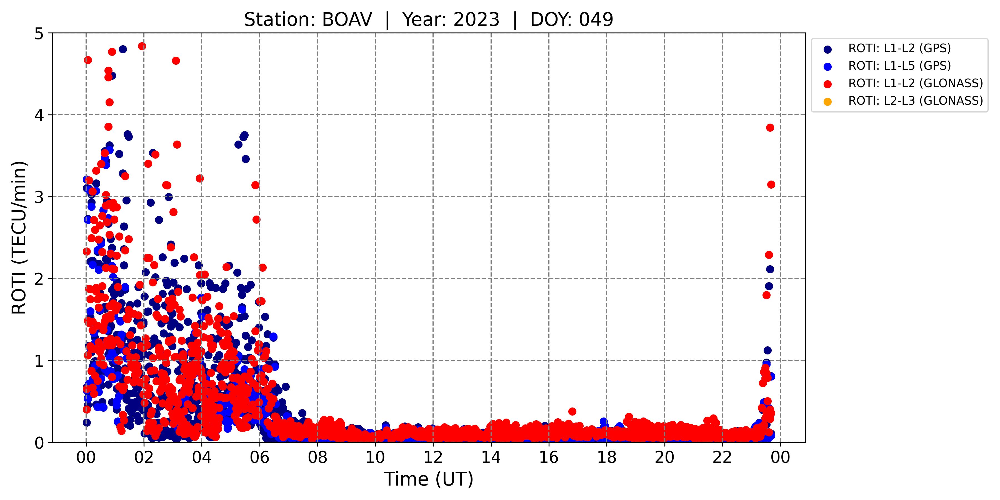

<p align="center">
  
</p>

# OASIS: Open-Access System for Ionospheric Studies

**OASIS** is a modular and open-access Python toolbox for processing multi-frequency GNSS data and computing ionospheric indices. It was developed to overcome limitations of proprietary or non-standardized tools and to promote scientific transparency and reproducibility in ionospheric research.

OASIS automates the detection and correction of cycle slips and outliers, performs arc-wise geometry-free (GF) leveling, and derives ionospheric indices directly from calibrated observations, without relying on external products such as Differential Code Biases (DCBs) or vertical TEC maps.

---

## Key Features

- Processes RINEX v2 and v3 files with 15- or 30-second sampling rates.
- Supports GPS and GLONASS constellations (Galileo and BeiDou coming soon).
- Fully autonomous detection of data gaps, cycle slips, and outliers.
- Arc-wise geometry-free leveling of carrier-phase combinations.
- Computation of ionospheric indices: **ROTI**, **ΔTEC**, and **SIDX**.
- No dependency on DCBs or global TEC maps.

---

## Installation Requirements

- Python 3.8 or higher
- Required libraries (see `requirements.txt` for exact versions):
  - `numpy`
  - `pandas`
  - `matplotlib`
  - `scipy`
  - `astropy`
  - `georinex`
  - `pyproj`

To install all dependencies at once:

```bash
pip install -r requirements.txt
```

---

## Workflow Summary

1. **Input**: RINEX observation files (e.g., `boav0491.23o`) and MGEX SP3 precise orbit files (e.g., `GFZ0MGXRAP_20230490000_01D_05M_ORB.SP3`).
2. **Orbit Interpolation**: SP3 orbits are parsed and interpolated to match GNSS epochs.
3. **IPP Calculation**: Coordinates of the ionospheric pierce point (IPP) are computed for each satellite-receiver pair.
4. **MW Combination**: The Melbourne–Wübbena combination is applied to detect and correct cycle slips.
5. **Screening**:
   - Initial outlier removal based on residuals from ∆MW polynomial fitting.
   - Fine-grained residual analysis defines mini-arcs based on sign changes.
6. **Geometry-Free Leveling**: Performed arc-wise on valid L1–L2, L1–L5, or L2–L3 combinations.
7. **Index Derivation**:
   - **ROTI**: Standard deviation of the Rate of TEC in 1-minute windows.
   - **ΔTEC**: Difference between 15-minute and 60-minute moving averages of geometry-free combinations.
   - **SIDX**: Mean absolute ROT over a 1-minute interval, sensitive to co-seismic and auroral disturbances.

---

## How to Run

1. Place the required RINEX observation files (`.yyo`) and MGEX SP3 orbit files (`.SP3`) inside the `INPUT/` directory.
2. In `main.py`, define the station code, year, day of year (DOY), and paths to the input and output directories.
3. Run the pipeline:

```bash
python main.py
```

3. Results are saved in structured output folders, organized by station and satellite.

---

## Directory Structure

- `SP3_INTERPOLATE.py` – Interpolates MGEX SP3 precise orbit files and generates tabulated satellite positions in the format `ORBITS_YYYY_DOY.SP3`.
- `RNX_CLEAN.py` – Parses RINEX observation files and produces initial GNSS datasets organized by satellite and station. Assigns ionospheric pierce point (IPP) coordinates and flags preliminary gaps, outliers, and cycle slips. Output: `STAT_SAT_DOY_YYYY.RNX1`.
- `RNX_SCREENING.py` – Refines arc definitions and detects outliers and cycle slips using ∆MW residuals and polynomial fitting. Output: `STAT_SAT_DOY_YYYY.RNX2`.
- `RNX_LEVELLING.py` – Performs arc-wise geometry-free leveling on refined data arcs. Output: `STAT_SAT_DOY_YYYY.RNX3`.
- `ROTI_CALC.py` – Calculates the Rate of TEC Index (ROTI) from leveled geometry-free combinations in `.RNX3`.
- `DTEC_CALC.py` – Calculates the detrended TEC index (ΔTEC) using 15-minute and 60-minute moving averages of leveled combinations.
- `SIDX_CALC.py` – Calculates the Sudden Ionospheric Disturbance Index (SIDX) as the mean absolute value of ROT in 1-minute windows.
- `linear_combinations.py`, `gnss_freqs.py`, `settings.py`, `glonass_channels.dat`, etc. – Supporting modules for GNSS frequency combinations, coordinate transformations, and IPP computation.

---

## Outputs

- Time series of arc-wise leveled geometry-free combinations for each GPS and GLONASS satellite.
- ROTI, ΔTEC, and SIDX indices computed per satellite and station.
- Visualizations of geometry-free combinations and derived ionospheric indices.

---

## Geometry-Free Leveling Example

<p align="center">
  
</p>

*Example of arc-wise geometry-free leveling for GNSS signals at station BOAV (year 2023, day 049), using L1–L2 and L1–L5 combinations for GPS, and L1–L2 and L2–L3 for GLONASS. Each curve represents a leveled geometry-free combination over a continuous observation arc.*

---

## ROTI Example

<p align="center">
  
</p>

*Example of Rate of TEC Index (ROTI) for GPS (L1–L2, L1–L5) and GLONASS (L1–L2, L2–L3) signals at station BOAV (year 2023, day 049). This plot highlights ionospheric irregularities typically associated with nighttime equatorial plasma bubbles. Elevated ROTI values are observed between 00:00 and 07:00 UT, and again after 23:00 UT, consistent with post-sunset and pre-dawn plasma bubble activity.*

---

## Cite This Work

If you use this software in your research, please cite:

<details>
<summary><strong>APA</strong></summary>

Picanço, G.A.S., Fagundes, P.R., Prol, F.S., Denardini, C.M., Mendoza, L.P.O., Pillat, V.G., Rodrigues, I., Christovam, A.L., Meza, A.M., Natali, M.P., Romero-Hernández, E., Aguirre-Gutierrez, R., Agyei-Yeboah, E., & Muella, M.T.A.H. (2025). *Introducing OASIS: An Open-Access System for Ionospheric Studies*. GPS Solutions. *(submitted)*

</details>

<details>
<summary><strong>ABNT</strong></summary>

PICANÇO, G.A.S.; FAGUNDES, P.R.; PROL, F.S.; DENARDINI, C.M.; MENDOZA, L.P.O.; PILLAT, V.G.; RODRIGUES, I.; CHRISTOVAM, A.L.; MEZA, A.M.; NATALI, M.P.; ROMERO-HERNÁNDEZ, E.; AGUIRRE-GUTIERREZ, R.; AGYEI-YEBOAH, E.; MUELLA, M.T.A.H. Introducing OASIS: An Open-Access System for Ionospheric Studies. *GPS Solutions*, 2025. Manuscrito submetido para publicação.

</details>

<details>
<summary><strong>GitHub Repository</strong></summary>

Picanço, G. A. S. (2025). **OASIS: Open-Access System for Ionospheric Studies** [Software]. GitHub.  
Available at: https://github.com/giorgiopicanco/OASIS  
Accessed: April 30, 2025.

</details>

---

## Contact

Developed by Giorgio Picanço (Ph.D. in Space Geophysics).
  
For questions or contributions, please visit:  
[https://github.com/giorgiopicanco/OASIS](https://github.com/giorgiopicanco/OASIS)  
or email: giorgiopicanco@gmail.com

---

## License

The OASIS toolbox is open-source and free to use under the Creative Commons Attribution-NonCommercial 4.0 International (CC BY-NC 4.0) license.
You are free to use, adapt, and share this software for non-commercial purposes, as long as proper credit is given.
